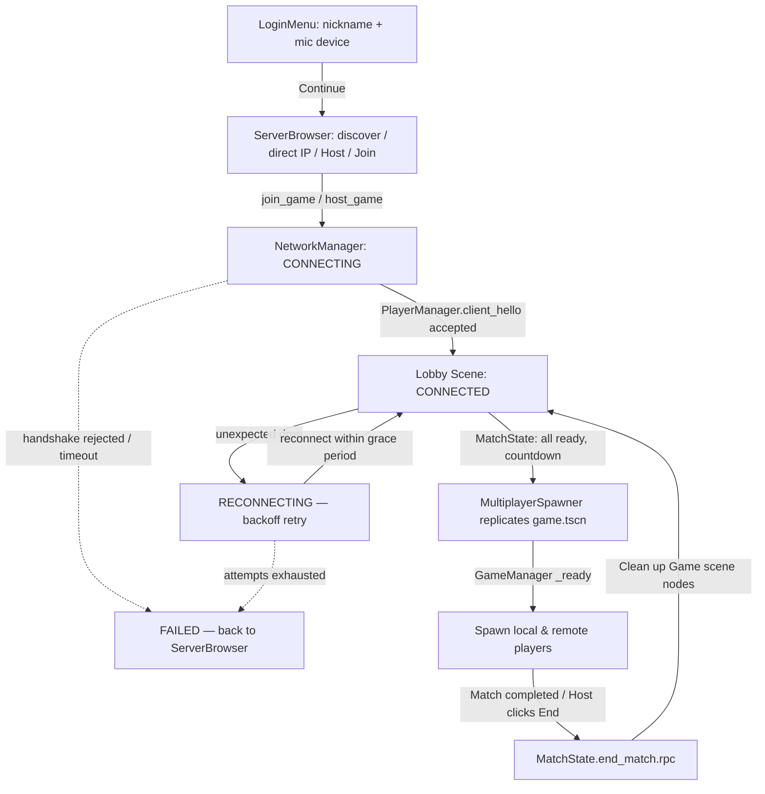

# Codebase Architecture

This multiplayer template is built around four core architectural tenets: **Strict Server Authority**,
**Scoped Event-Driven Communication**, **Decentralized Entity State**, and **Signals Over Direct
Coupling** for reusable components.

---

## 1. Directory Structure

Here is an overview of the key folders and files in this template:

```
├── autoloads/                    # Global singletons
│   ├── event_bus.gd              # UI & non-gameplay event dispatcher
│   ├── network_manager.gd        # ENet connection, handshake, reconnect, kick/ban
│   ├── player_manager.gd         # Peer identity, profiles, reconnect detection
│   ├── chat_network.gd           # Chat transport (the only chat piece aware of multiplayer)
│   ├── voip_network.gd           # VOIP transport (the only VOIP piece aware of multiplayer)
│   ├── settings_manager.gd       # Persisted user settings (user://settings.cfg); applies them live
│   ├── localization.gd           # Discovers/registers localization/locales/*.json with TranslationServer
│   └── server_console.gd         # Dedicated-server-only stdin admin console (list/kick/ban/unban)
├── addons/twovoip/                # Opus/RNNoise GDExtension backing the VOIP stack
├── voip/                          # Transport-agnostic VOIP core
│   ├── voip_config.gd            # Tunable VOIP parameters (Resource)
│   ├── voip_microphone.gd        # Capture + Opus encode; emits packet signals
│   └── voip_speaker.gd           # Per-peer playback: jitter buffer, FEC, drift compensation, proximity fade
├── netcode/                       # Transport-and-input-agnostic rollback core
│   └── rollback_controller.gd    # Tick/prediction/reconciliation — see docs/netcode.md
├── session/                       # Match-flow state, decoupled from any particular lobby UI
│   └── match_state.gd            # Ready-up/countdown/match-lifecycle state machine (signals only)
├── localization/locales/          # One self-contained JSON file per language — see Section 5
│   ├── en.json
│   └── pt_BR.json
├── assets/                        # Sprites, sounds, and other static assets
├── scenes/                        # Scenes containing nodes and GDScripts
│   ├── login_menu.tscn           # Nickname entry, mic device picker, Settings launcher
│   ├── server_browser.tscn       # LAN server discovery, direct-IP join, host/create
│   ├── lobby.tscn                # Room lobby: player list, chat, orchestrates the components below
│   ├── voice_panel.gd            # Per-peer mute/volume controls for whichever peer is selected
│   ├── admin_panel.gd            # Per-peer kick/ban controls for whichever peer is selected
│   ├── settings_menu.tscn        # Settings overlay (Audio/Video/Input/Voice tabs + Quit) — see Section 6
│   ├── chat_ui.tscn              # Server-relayed, sanitized chat component (embedded in Lobby)
│   ├── ping_label.gd             # Ping HUD (embedded in Lobby); listens to NetworkManager.ping_updated
│   ├── system_alert_modal.tscn   # Autoload (despite living here) — see Section 3, EventBus.system_alert
│   ├── game.tscn                 # Playable level with GameManager
│   ├── player.tscn               # Player avatar: movement/animation + a RollbackController child
│   └── game_camera.tscn          # Independent follow camera
```

---

## 2. Core Architecture Tenets

### 1. Strict Server Authority
The client is never trusted. Actions (e.g., movement, starting matches, chat, kicking a player, etc.)
are structured as requests sent to the server. The server verifies them against the current state and
broadcast-replicates them. Every RPC that accepts data from `"any_peer"` re-derives the sender from
`multiplayer.get_remote_sender_id()` — never trusts a claimed identity in the payload itself.

### 2. Scoped UI Event Bus
The `EventBus` singleton is strictly reserved for **UI and Non-Gameplay events**.
*   **Allowed**: `player_connected`, `clear_chat`, `player_data_updated`, `match_ended`,
    `connection_state_changed`, `peer_identity_migrated`, `system_alert`.
*   **Prohibited**: Direct physics synchronization, bullet hits, health reduction, player velocity
    updates, or high-frequency streaming data (e.g. voice packets, input frames).
By scoping the `EventBus` this way, we avoid creating a "God Object" and keep gameplay components
highly modular. High-frequency, domain-specific traffic gets its own dispatcher instead — voice packets
flow through `VoipNetwork`'s own RPCs straight to the per-peer `VoipSpeaker` nodes, and input/rollback
data flows through `RollbackController`'s own RPCs, never through `EventBus`.

### 3. Decentralized Node State
We avoid storing global states in singletons. State belongs directly to the nodes themselves (e.g.,
position, color, and voice streaming reside on the `Player` node) and is synced automatically via
`MultiplayerSynchronizer` or `MultiplayerSpawner`.

### 4. Signals Over Direct Coupling (for reusable components)
Components meant to be reusable across different UIs or games — `VoipMicrophone`/`VoipSpeaker`,
`RollbackController`, `MatchState`, `VoicePanel`/`AdminPanel` — expose only signals or injected
callbacks, and hold **no references to any specific UI, scene, or game logic**. `MatchState`, for
example, knows nothing about chat messages or the `game.tscn` scene file; `lobby.gd` listens to its
signals and decides what a "match starting" event should look like on screen. This means a completely
different lobby UI — or no lobby UI at all — can drive the same state machine by listening to the same
signals, without copying or modifying `MatchState` itself.

---

## 3. Global Singletons (Autoloads)

Load order matters here (`project.godot`'s `[autoload]` section) — several depend on ones listed before
them having already run their `_ready()`:

```
EventBus → SystemAlertModal → PlayerManager → NetworkManager → ChatNetwork → VoipNetwork
    → SettingsManager → Localization → ServerConsole
```

### [network_manager.gd](../autoloads/network_manager.gd)
Owns the ENet connection itself: hosting, joining, a `ConnectionState` state machine
(`DISCONNECTED/CONNECTING/CONNECTED/RECONNECTING/FAILED`, exposed via `EventBus.connection_state_changed`),
automatic reconnect with exponential backoff on an unexpected drop, and the version/identity handshake
plumbing (`accept_handshake`/`reject_handshake`, with a timeout for a peer that never completes it). Also
owns moderation: `kick_peer`/`ban_peer` (server-authoritative, checked via `is_admin()` — the host is
always an admin; `admin_uuids` extends that to specific players for the headless dedicated-server path,
which has no host player) and ban persistence (`user://bans.cfg`, keyed by both peer UUID and IP). Only
measures round-trip time (`ping_updated` signal, `current_ping`) and never touches a Control itself — the
actual HUD is `scenes/ping_label.gd`, same split as `VoipNetwork` vs `VoicePanel`.

`PROTOCOL_VERSION` here must be bumped whenever an RPC signature or the *node path* an RPC lives on
changes anywhere in the project — see the constant's own doc comment for the version history and why a
node-path change is a wire-format break just as much as a parameter change is.

### [system_alert_modal.tscn](../scenes/system_alert_modal.gd)
Registered as an autoload despite living under `scenes/` (it's global UI, not a piece of any one scene —
same reasoning as `ping_label.gd` living under `scenes/` while being embedded in `Lobby.tscn`). Shows a
blocking modal for connection notices that a chat message can't reliably deliver: ones that end the
session (kicked, banned, handshake rejected, host left, reconnect exhausted — `EventBus.system_alert`,
queued if more than one fires close together) and one in-progress, self-resolving one ("attempting to
reconnect...", dismissed via `EventBus.system_alert_clear` if the reconnect actually succeeds before the
player dismisses it). Deliberately knows nothing about networking, kicking, or banning — it only listens
to those two `EventBus` signals — so a project can swap in its own modal styling without touching
`NetworkManager` at all, same split as `VoipNetwork` vs `VoicePanel`.

The three cases that fire `system_alert` today: `NetworkManager._send_kicked` (kick/ban reason),
`NetworkManager._send_handshake_rejected` (protocol mismatch, banned-on-join, duplicate connection —
previously only reached a `push_warning`, never actually shown to the player), and
`NetworkManager._send_host_left` (the host closed the session deliberately via Leave Room or Quit — see
`_host_left_deliberately`, which also makes `_maybe_reconnect()` skip straight to `FAILED` instead of
retrying against a server that isn't coming back). `Lobby.gd` fires the two non-`NetworkManager` cases:
the in-progress "attempting to reconnect" alert on an unannounced drop, and the terminal "could not
reconnect" alert once retries are exhausted (skipped if one of the three cases above already explained
the failure — see `NetworkManager.has_explained_failure()`).

### [player_manager.gd](../autoloads/player_manager.gd)
Stores profiles of connected users (`players: peer_id -> {"name": ...}`) and the persistent per-install
`client_uuid` (a UUIDv4 in `user://client_identity.cfg`) that lets the server recognize a reconnecting
client as the *same player* even though ENet always hands out a fresh `peer_id` on reconnect. The
`client_hello` RPC (version + uuid + profile, all together) is the entire handshake payload; a reconnect
within `RECONNECT_GRACE_SEC` restores the old profile and broadcasts `EventBus.peer_identity_migrated`
so every other system (`VoipNetwork`'s mute/volume prefs, `lobby.gd`'s selection state,
`MatchState`'s ready flags) can remap its own `peer_id`-keyed state instead of silently orphaning it.

### [chat_network.gd](../autoloads/chat_network.gd)
The chat transport layer, and the **only** chat piece that knows multiplayer exists — same split as
`VoipNetwork` vs `VoipMicrophone`/`VoipSpeaker`, or `NetworkManager` vs `ping_label.gd`. Owns the
request/relay/broadcast RPCs and input sanitization (strips `[`/`]` so a player can't inject BBCode into
someone else's chat log); `ChatUI` (embedded in `Lobby.tscn`) is a thin subscriber that only calls
`send_message()` and listens to `message_received(channel, sender_id, text)`.

`channel` is a caller-defined `String` key (`"lobby"` today) that this file never branches on itself —
it's opaque routing, not a fixed set of rooms. A future DM/phone feature would pick its own channel
naming (e.g. `"phone:<peer_id>"`) and set `channel_recipients` (server-only, `(channel, sender_id) ->
Array[int]`) to decide who actually receives it; left unset, every connected peer receives everything,
today's lobby-chat behavior.

### [voip_network.gd](../autoloads/voip_network.gd)
The VOIP transport layer, and the **only** VOIP component that knows multiplayer exists. Owns the local
[VoipMicrophone](../voip/voip_microphone.gd) and relays its packets client → server → peers using the
same server-authoritative RPC model as the rest of the template. Stream headers/footers travel reliably
(a lost header stalls a whole talk burst); Opus frames travel unreliably (a lost frame is concealed by
the speaker's FEC). Also owns purely-local listening preferences (per-peer mute/volume — never sent over
the network, since whether *I* hear *you* is my decision alone) and an optional `voice_relevance`
callback the game can supply for server-side proximity culling, without `VoipNetwork` ever needing to
know what a "position" is.

The capture and playback nodes under [voip/](../voip/) are deliberately transport-agnostic:
`VoipMicrophone` emits packet signals and `VoipSpeaker` consumes them via `receive_packet()`, neither
touching the network. `VoipSpeaker` also drives its own plateau-then-fade proximity curve
(`fade_start_distance`/`max_distance`/`attenuation` on `VoipConfig`) rather than relying on Godot's
built-in `AudioStreamPlayer2D` attenuation, which has no plateau. Swapping `voip_network.gd` moves the
entire VOIP stack onto a different transport without editing either.

> **Do not** re-route capture through `AudioStreamMicrophone` + `AudioEffectCapture`. That path runs the
> mic through the *output* mixer's clock and corrupts the capture rate behind virtual audio devices —
> the bug that killed this project's previous VOIP system. See `voip_microphone.gd`'s own doc comment
> for the full incident, or [known-limitations.md](known-limitations.md) for the short version.

### [settings_manager.gd](../autoloads/settings_manager.gd)
`ConfigFile`-backed persistence (`user://settings.cfg`) for audio bus volumes, video (fullscreen/window
size), input keybind remapping (scoped to an explicit `REMAPPABLE_ACTIONS` list — Godot's own `ui_*`
built-ins are deliberately left alone), voice settings, and the active locale. A settings UI stages
changes and calls the `set_*` functions on confirm — several voice setters rebuild the VOIP encoder
(`VoipMicrophone.apply_config()`, which **ends any active talk burst**), so nothing here is safe to bind
directly to a slider's `value_changed` signal; see the file's own doc for which fields are the exception.

### [localization.gd](../autoloads/localization.gd)
Discovers language files under `localization/locales/*.json` at startup (one self-contained
`{"locale", "name", "strings"}` file per language — adding a language is a file drop, no code change)
and registers them with `TranslationServer`. `retranslate_tree(root)` is the actual mechanism that
applies translations to a scene's `Control.text`/`placeholder_text` — **not** Godot's built-in
`auto_translate_mode`, which turned out not to reliably re-resolve an assigned property value when this
was verified. Every top-level scene calls `Localization.retranslate_tree(self)` once in its own
`_ready()`, and it's called again automatically on every live language switch. See the file's own doc
for the full reasoning and its fail-safes (a malformed locale file is skipped with a warning, never
crashes the scan; a missing saved locale falls back to `en`, then to whatever did load).

### [server_console.gd](../autoloads/server_console.gd)
Text-mode equivalent of `AdminPanel`'s Kick/Ban buttons for whoever's running a dedicated server —
`list`/`kick <peer_id>`/`ban <peer_id>`/`unban_uuid <uuid>`/`unban_ip <ip>`, calling the exact same
`NetworkManager`/`PlayerManager` functions those buttons call. No enforcement logic of its own. Only
active when `OS.has_feature("headless")` — a windowed client/host has no terminal for a player to type
into. Reads `stdin` on its own `Thread` (blocking reads can't share the main thread) and marshals
commands back via `call_deferred()`; also logs every chat message server-side via a plain function call
from `ChatNetwork._process_send()` (no RPC needed — both already run in the same server process).

---

## 4. Lobby Composition (Signals Over Direct Coupling, in practice)

`lobby.gd` is deliberately *thin* — an orchestrator, not the owner of ready-state, voice controls,
moderation, or chat logic. It wires up several independent components and reacts to their signals:

```
Lobby (Control)
├── MatchState (Node)       — ready-up/countdown/match lifecycle; signals only, no UI refs
├── PeerVoiceControls (VoicePanel)  — mute/volume for whichever peer_id Lobby says is selected
├── AdminControls (AdminPanel)      — kick/ban for whichever peer_id Lobby says is selected
├── SettingsMenu (overlay)          — instantiated as a child, not scene-swapped, so opening
│                                       Settings never disconnects an active session
├── ChatUI                          — thin: calls ChatNetwork.send_message(), listens to
│                                       ChatNetwork.message_received; owns no RPCs itself
└── PingHud (ping_label.gd)         — listens to NetworkManager.ping_updated; owns no RPCs itself
```

`lobby.gd` owns only: the player list, connection-status display, the local mic mute button, and
translating each component's signals into chat/system messages and button-text updates. None of these
components know about each other or about `lobby.gd`'s internals — `lobby.gd` is the only thing that
knows they all exist. `SystemAlertModal` isn't in this tree at all — it's a global autoload, not a
`Lobby.tscn` child, because its alerts (kicked, host left, connection lost) need to survive the exact
scene change that follows most of them (see its own write-up in Section 3).

---

## 5. Match Lifecycle Flow



Reconnect identity restoration (name, ready status, other players' VOIP prefs about you) only applies
within `PlayerManager.RECONNECT_GRACE_SEC` of the drop, and only restores *lobby* identity — reconnecting
mid-match does not currently respawn your `Player` avatar into the running `Game` scene (a documented
gap, see [known-limitations.md](known-limitations.md)).
